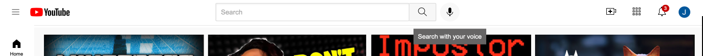

YouTube Homepage Recreation 🎥

For this project I built a responsive front-end clone of YouTube’s homepage using HTML5 and CSS3. I implemented all of my favorite YouTube videos from many years of watching. This project helped me practice layout, positioning, and responsiveness while experimenting with multiple CSS features. This project is my biggest one up to this date and I found it super fun to work and learn front-end programming. For my next project I will make sure to now learn JavaScript and more of Python to implement backend with front-end.

⸻

What I Implemented

	•	Responsive Design → I used media queries to adjust the video grid layout for different screen sizes, making the page mobile-friendly.
	•	CSS Grid → I structured the video previews in a clean grid layout that dynamically changes from 2 → 3 → 4 columns depending on the screen width.
	•	Nested Flexbox → I used flexbox inside sections like the header, sidebar, and video info to align icons, text, and buttons.
	•	Positioning (absolute & relative) → I positioned elements like the header, sidebar, and video timestamps to overlay correctly and stay fixed when scrolling.
	•	Hover Effects & Tooltips → I added hover states for sidebar links, buttons, and tooltips to give the design an interactive feel.
	•	Consistent Styling → I styled elements with the Roboto font, consistent spacing, and color palette to mimic the YouTube UI.

⸻

Project Structure

	•	youtube.html → The main HTML page
	•	header.css → Styles for the top navigation bar and search bar

	
	•	sidebar.css → Styles for the fixed sidebar navigation
	•	video.css → Styles for video thumbnails, grid layout, and responsiveness
	•	general.css → Base styles and global resets

⸻

What I Learned

This project helped me strengthen my skills in:
	•	Combining flexbox and grid layouts for complex UIs
	•	Managing fixed and absolute positioning for sticky headers and overlays
	•	Designing responsive web pages with media queries
	•	Writing clean, modular CSS split across multiple files

⸻

📸 Preview

